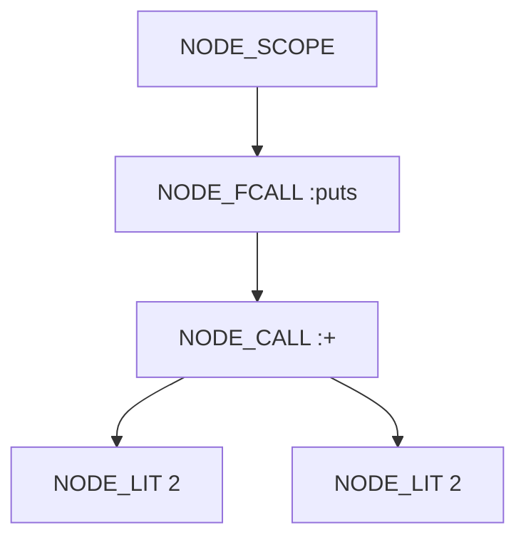
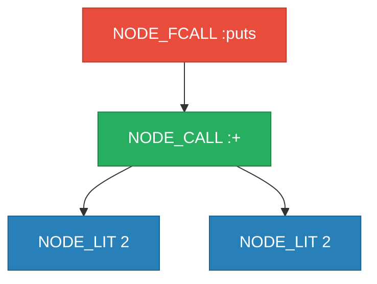
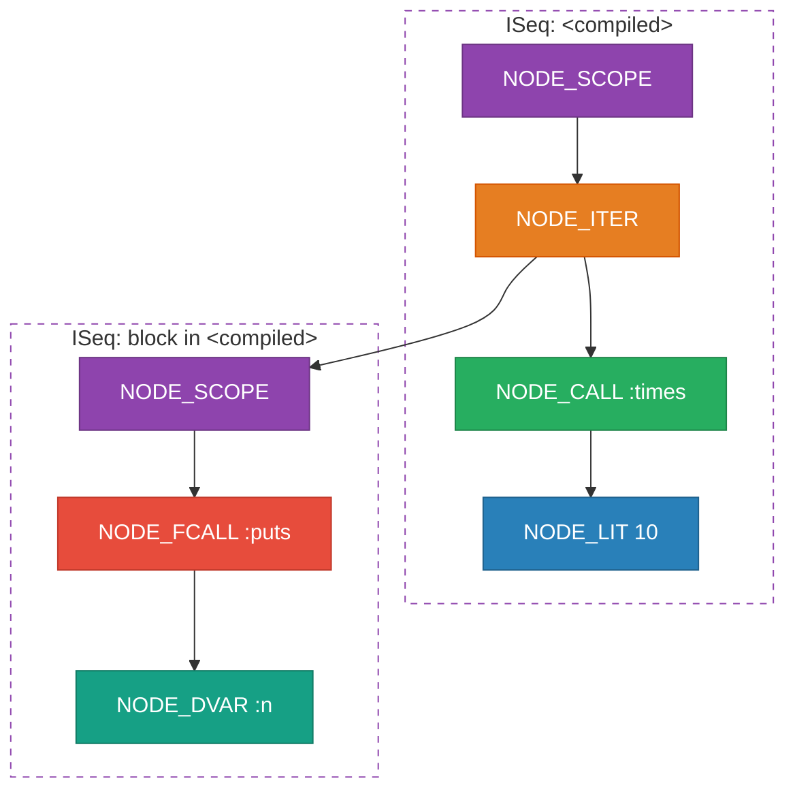
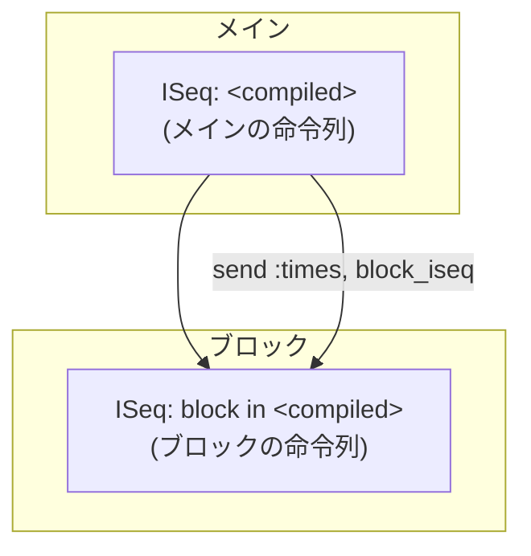

# Rubyのコンパイル

## AST から YARV命令へ

「Rubyのしくみ」2章より

<div class="abs-br m-6 text-sm opacity-50">
  Ruby Under a Microscope — Ch.2 Compilation
</div>

---
transition: fade-out
---

# 今日のスコープ

Ruby がコードを実行するまでの流れ


<v-click>

今回のフォーカスは **コンパイル** ── AST を YARV 命令列に変換するステップ

</v-click>

<v-click>

- 入力: AST（抽象構文木）
- 出力: YARV 命令列（バイトコード）

</v-click>

---

# Ruby 1.8 → 1.9 の転換

なぜ「コンパイル」が必要になったのか

<div class="grid grid-cols-1 gap-1 mt-1">
<div>

### Ruby 1.8

<div class="text-sm">

- AST を直接たどって実行（**ツリーウォーク型** インタプリタ）

</div>


</div>
<div>

### Ruby 1.9+

<div class="text-sm">

- AST → **YARV 命令列**（中間表現）にコンパイル
- スタックベースのVM で実行
- Ruby 1.8 より高速
  - 理由は[rubykaigi-bootcamp-2025](https://github.com/Nozomi-Hijikata/slides/blob/top/rubykaigi-bootcamp-2025/pages/ruby-process.md#layout-default-24)）を参照


</div>


</div>
</div>

---

# 題材コード

まずはシンプルな例から

```ruby
puts 2 + 2
```

<v-click>

このたった1行のコードが、内部でどのようにコンパイルされるか見ていこう。

</v-click>

<v-click>

**確認方法:**

```ruby
RubyVM::InstructionSequence.compile("puts 2 + 2").disasm
```

`RubyVM::InstructionSequence` を使うと、Ruby コードがコンパイルされた後の YARV 命令列を覗ける。

</v-click>

---
layout: two-cols
---

# AST の構造

`puts 2 + 2` がどんな木になるか



<v-click>


</v-click>

::right::

<v-click at="0">

<div class="mt-12">

| **ノード** | **意味** |
|:---:|:---:|
| **NODE_SCOPE** | プログラム全体を囲むスコープ |
| **NODE_FCALL** | 関数的メソッド呼び出し（`puts`、レシーバ省略）|
| **NODE_OPCALL** | 演算子メソッド呼び出し（`+`）|
| **NODE_LIT** | リテラル値（整数 `2`）|

コンパイラはこの木を再帰的にたどり、各ノードに対応する YARV 命令を生成する。

</div>

</v-click>

---
layout: two-cols
layoutClass: gap-4
---

# ASTノード → YARV命令 の変換

<span class="node-fcall">NODE_FCALL</span> / <span class="node-call">NODE_CALL</span> / <span class="node-lit">NODE_LIT</span> を再帰的にたどる



::right::

<div class="mt-8 text-sm">

### 生成される命令列

<v-click>

**①** <span class="node-fcall">NODE_FCALL :puts</span> → レシーバが必要

```
putself
```

</v-click>

<v-click>

**②** <span class="node-call">NODE_CALL :+</span> に再帰 → レシーバ→引数→メソッドの順

</v-click>

<v-click>

- <span class="node-lit">NODE_LIT 2</span>（レシーバ）→ `putobject 2`
- <span class="node-lit">NODE_LIT 2</span>（引数）→ `putobject 2`
- メソッド `:+` → `opt_plus`

</v-click>

<v-click>

**③** <span class="node-fcall">NODE_FCALL :puts</span> に戻る

```
opt_send_without_block :puts
```

</v-click>

<v-click>

**④** 完了 → `leave`

</v-click>

</div>

<v-click>

<div class="text-xs mt-2 p-2 bg-amber-50 dark:bg-amber-950 rounded">

**ポイント:** NODE_CALL ではレシーバ → 引数 → メソッドの順にスタックへプッシュする

</div>

</v-click>

---
layout: two-cols
layoutClass: gap-4
---

# YARV命令列

`puts 2 + 2` のコンパイル結果

```txt {all|1|2-3|4|5|6}{lines:true}
putself
putobject 2
putobject 2
opt_plus
opt_send_without_block :puts
leave
```

<v-click at="1">

| 命令 | 意味 |
|------|------|
| `putself` | レシーバ（top）をスタックに積む |
| `putobject 2` | 整数 2 をスタックに積む |
| `opt_plus` | スタックから2つ取り出し加算 |
| `opt_send_without_block` | メソッド呼び出し |
| `leave` | 終了 |

</v-click>

::right::

### 実際の disasm 出力

```txt {*}{maxHeight:'400px'}
== disasm: #<ISeq:<compiled>@<compiled>:1 (1,0)-(1,10)>
0000 putself                          (   1)[Li]
0001 putobject                   2
0003 putobject                   2
0005 opt_plus                    <calldata!mid:+,
                                  argc:1,
                                  ARGS_SIMPLE>[CcCr]
0007 opt_send_without_block      <calldata!mid:puts,
                                  argc:1,
                                  FCALL|ARGS_SIMPLE>
0009 leave
```

---

# ブロック付き呼び出し

次はブロックを含むコードを見てみよう

```ruby
10.times do |n|
  puts n
end
```

<v-click>

ブロックがある場合、コンパイル結果はどう変わるか？

**ポイント:** メインの命令列とブロックの命令列は **別々に** コンパイルされる。

</v-click>

---
layout: two-cols
layoutClass: gap-4
---

# ブロック付き AST → YARV変換

<span class="node-iter">NODE_ITER</span> が2つの <span class="node-scope">NODE_SCOPE</span> を分離する



::right::

<div class="mt-4 text-sm">

### 変換ステップ

<v-click>

**①** <span class="node-scope">NODE_SCOPE</span>（メイン）→ ISeq `<compiled>` を生成

</v-click>

<v-click>

**②** <span class="node-lit">NODE_LIT 10</span>（レシーバ）→ `putobject 10`

</v-click>

<v-click>

**③** <span class="node-iter">NODE_ITER</span> → ブロック内の <span class="node-scope">NODE_SCOPE</span> を**別ISeq**として分離コンパイル

</v-click>

<v-click>

**④** [ブロックISeq]
- <span class="node-fcall">NODE_FCALL :puts</span> → `putself`
- <span class="node-dvar">NODE_DVAR :n</span> → `getlocal_WC_0`
- `:puts` → `opt_send_without_block`
- `leave`

</v-click>

<v-click>

**⑤** [メインISeqに戻る]
- `send :times, block in <compiled>`
- `leave` → メインISeq完成

</v-click>

</div>

<v-click>

<div class="text-xs mt-2 p-2 bg-amber-50 dark:bg-amber-950 rounded">

**ポイント:** 各 <span class="node-scope">NODE_SCOPE</span> が独立した InstructionSequence を生成する — メイン用とブロック用で別々にコンパイルされる

</div>

</v-click>

---
layout: two-cols
layoutClass: gap-4
---

# メインの命令列

`10.times do ... end` のコンパイル結果

```txt {all|1|2|3}
putobject 10
send :times, block in <compiled>
leave
```

<v-click at="1">

<div class="text-sm">

- `putobject 10` — レシーバ 10 をスタックに積む
- `send :times` — `times` メソッドを呼び出し（**ブロックへの参照** を一緒に渡す）
- `leave` — 終了

</div>

</v-click>

<v-click at="1">

### 実際の disasm 出力

```txt
== disasm: #<ISeq:<compiled>@<compiled>:1
                               (1,0)-(3,3)>
0000 putobject     10          (   1)[Li]
0002 send          <calldata!mid:times,
                    argc:0>,
                    block in <compiled>
0005 leave
```

</v-click>

::right::

# ブロックの命令列

ブロック部分は独立した InstructionSequence

```txt {all|1|2|3|4}
[ ローカルテーブル: n@0 ]
putself
getlocal_WC_0  n@0
opt_send_without_block :puts
leave
```

<v-click at="1">

<div class="text-sm">

- ブロック引数 `n` はローカルテーブルに格納
- `getlocal_WC_0` でインデックス指定で取得
- `WC_0` = "ワイルドカード 0" = 現在のスコープ

</div>

</v-click>

<v-click at="1">

### 実際の disasm 出力

```txt
== disasm: #<ISeq:block in <compiled>
                    @<compiled>:1 (1,9)-(3,3)>
local table (size: 1, argc: 1)
[ 1] n@0
0000 putself                   (   2)[LiBc]
0001 getlocal_WC_0             n@0
0003 opt_send_without_block    <calldata!
                  mid:puts, argc:1,
                  FCALL|ARGS_SIMPLE>
0005 leave                     (   3)[Br]
```

</v-click>

---

# メインとブロックの関係

2つの InstructionSequence の親子関係



<v-click>

<div class="grid grid-cols-2 gap-4 mt-2 text-sm">
<div>

### 親（メイン）
- ブロックの ISeq への参照を保持
- `send` 命令でブロックを渡す
- ブロックの戻り値を受け取る

</div>
<div>

### 子（ブロック）
- 独自のローカルテーブルを持つ
- 親のスコープの変数にもアクセス可能（`getlocal_WC_1` で1つ上のスコープ）
- `[Bc]` フラグ = ブロック開始 / `[Br]` = 終了

</div>
</div>

</v-click>

---

# ローカルテーブル例① ブロック呼び出し

```ruby
10.times do |n| puts n end
```

<div class="grid grid-cols-2 gap-4 mt-2">
<div>

#### YARV 命令列（ブロックの ISeq）

```txt
== disasm: #<ISeq:block in <compiled>@<compiled>:1>
0000 putself                          [LiBc]
0001 getlocal_WC_0          n@0
0003 opt_send_without_block  :puts
0005 leave                            [Br]
```

</div>
<div>

#### ローカルテーブル

```txt
local table (size: 1, argc: 1
 [opts: 0, rest: -1, post: 0, block: -1])
[ 1] n@0<Arg>
```

<div class="text-sm mt-2">

- `size: 1` → 変数は `n` の1つ
- `argc: 1` → ブロック引数1つ

</div>

</div>
</div>

---

# ローカルテーブル例② 関数定義

```ruby
def add_two(a, b)
  sum = a + b
end
```

<div class="grid grid-cols-2 gap-4 mt-2">
<div>

#### YARV 命令列

```txt
== disasm: #<ISeq:add_two@<compiled>:1>
0000 getlocal_WC_0          a@0       [Li]
0002 getlocal_WC_0          b@1
0004 opt_plus
0006 dup
0007 setlocal_WC_0          sum@2
0009 leave
```

</div>
<div>

#### ローカルテーブル

```txt
local table (size: 3, argc: 2
 [opts: 0, rest: -1, post: 0, block: -1])
[ 3] a@0<Arg>  [ 2] b@1<Arg>  [ 1] sum@2
```

<div class="text-sm mt-2">

- `size: 3` → `a`, `b`, `sum` の3つ
- `argc: 2` → メソッド引数2つ（`sum` はローカル変数なので argc に含まれない）

</div>

</div>
</div>

---

# ローカルテーブルのフィールド

ローカルテーブルヘッダーの各フィールドの意味

```txt
local table (size: 3, argc: 2 [opts: 0, rest: -1, post: 0, block: -1, kw: ...])
```

| フィールド | 意味 | 値の読み方 |
|---|---|---|
| **size** | ローカル変数の総数 | `3` → 変数3つ |
| **argc** | 必須引数の数 | `2` → 引数2つ |
| **opts** | オプション引数の数 | `0` = なし, `1` = 1つ |
| **rest** | 可変長引数(`*args`)のインデックス | `-1` = なし |
| **post** | rest後の必須引数の数 | `0` = なし |
| **block** | ブロック引数(`&blk`)のインデックス | `-1` = なし |

<v-click>

<div class="text-sm mt-4">

**引数の種別タグ:**
`<Arg>` — 必須引数 / `<Opt=0>` — オプション引数（デフォルト値命令のラベル番号） / `<Rest>`, `<Post>`, `<Block>` — それぞれ対応する種別

</div>

</v-click>

<v-click>

<div class="text-sm mt-2 p-2 bg-blue-50 dark:bg-blue-950 rounded">

**実例:** `def greet(name, greeting="Hello")` の場合

```txt
local table (size: 2, argc: 1 [opts: 1, rest: -1, post: 0, block: -1])
[ 2] name@0<Arg>  [ 1] greeting@1<Opt=0>
```

`opts: 1` により `greeting` がオプション引数であることが分かる

</div>

</v-click>

---
layout: center
class: text-center
---

# まとめ

<div class="text-left inline-block text-sm leading-snug">

### Ruby のコンパイルで押さえるべきポイント

<v-clicks>

1. **AST → YARV 命令列** への変換がコンパイル
   - `compile.c` の `iseq_compile_each()` が AST を再帰的に処理

2. **スタックベース VM** — 命令がスタックを操作して計算を進める
   - `putobject`, `putself` で積む → 演算・メソッド呼び出しで消費

3. **最適化命令** — 頻出パターンを高速化
   - `opt_plus`, `opt_eq`, `opt_length` など

4. **ブロックは別の InstructionSequence** にコンパイル
   - 親子関係で参照、スコープチェーンでローカル変数にアクセス

5. **ローカルテーブル** — 変数名をインデックスに変換して高速アクセス
   - `getlocal` / `setlocal` + インデックスで `O(1)` アクセス

</v-clicks>

</div>

---
layout: center
class: text-center
---

# 参考文献

<div class="text-left inline-block mt-4">

- **Pat Shaughnessy 著「Rubyのしくみ」** 第2章 コンパイル
- `RubyVM::InstructionSequence` — [Ruby リファレンスマニュアル](https://docs.ruby-lang.org/ja/latest/class/RubyVM=3a=3aInstructionSequence.html)
- 笹田耕一「YARV: Yet Another RubyVM」

</div>

<div class="text-sm opacity-60">

デモ環境: Ruby 3.4.2 / macOS

</div>
