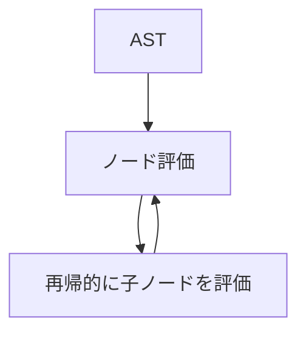
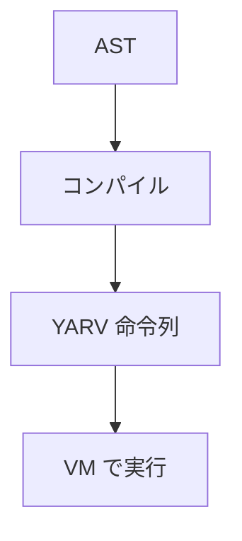
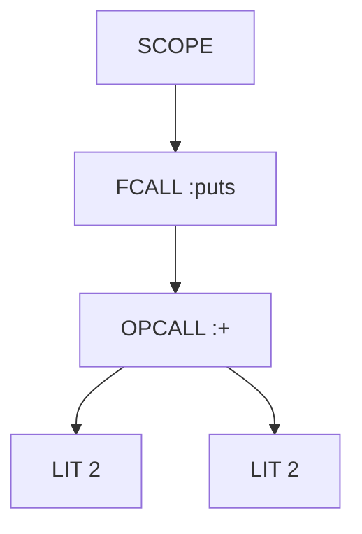
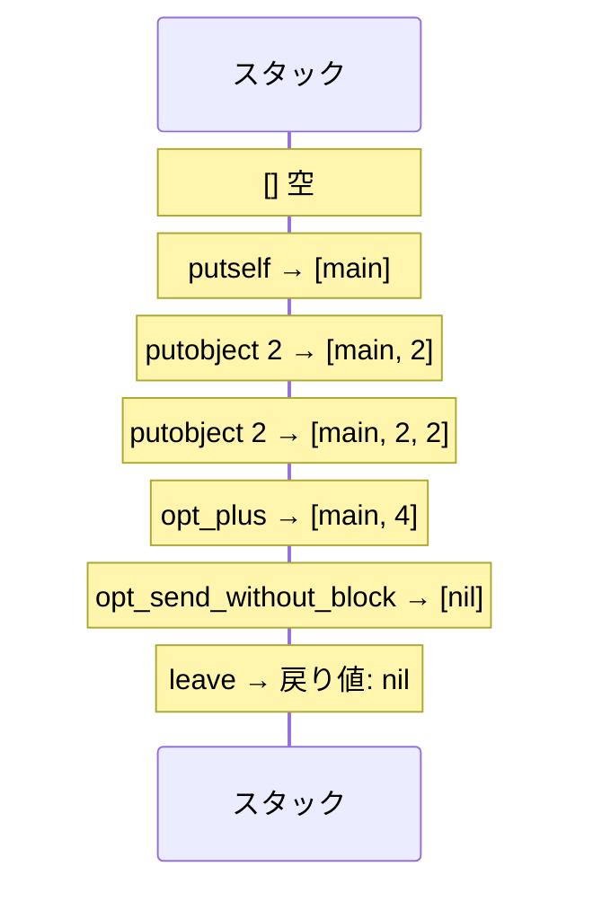
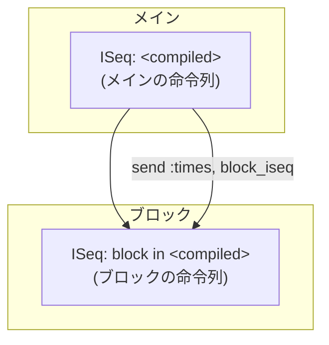

# Rubyのコンパイル

## AST から YARV命令へ

「Rubyのしくみ」2章より

<div class="abs-br m-6 text-sm opacity-50">
  Ruby Under a Microscope — Ch.2 Compilation
</div>

---
transition: fade-out
---

# 今日のスコープ

Ruby がコードを実行するまでの流れ


<br>

<v-click>

今回のフォーカスは **コンパイル** ── AST を YARV 命令列に変換するステップ

</v-click>

<v-click>

- 入力: AST（抽象構文木）
- 出力: YARV 命令列（バイトコード）

</v-click>

---

# Ruby 1.8 → 1.9 の転換

なぜ「コンパイル」が必要になったのか

<div class="grid grid-cols-2 gap-8 mt-4">
<div>

### Ruby 1.8（MRI）

- AST を直接たどって実行
- ノードを再帰的にたどる **ツリーウォーク型** インタプリタ
- シンプルだが遅い



</div>
<div>

### Ruby 1.9+（YARV）

- AST → **YARV 命令列** にコンパイル
- 命令列を **スタックベース VM** で実行
- 笹田耕一氏が開発した YARV を採用



</div>
</div>

---

# 題材コード

まずはシンプルな例から

```ruby
puts 2 + 2
```

<br>

<v-click>

このたった1行のコードが、内部でどのようにコンパイルされるか見ていこう。

</v-click>

<v-click>

**確認方法:**

```ruby
RubyVM::InstructionSequence.compile("puts 2 + 2").disasm
```

`RubyVM::InstructionSequence` を使うと、Ruby コードがコンパイルされた後の YARV 命令列を覗ける。

</v-click>

---

# AST の構造

`puts 2 + 2` がどんな木になるか



<v-click>

- **SCOPE** — プログラム全体を囲むスコープ
- **FCALL** — 関数的メソッド呼び出し（`puts`、レシーバ省略）
- **OPCALL** — 演算子メソッド呼び出し（`+`）
- **LIT** — リテラル値（整数 `2`）

</v-click>

<v-click>

コンパイラはこの木を **再帰的に深さ優先** でたどり、各ノードに対応する YARV 命令を生成する。

</v-click>

---
layout: two-cols
layoutClass: gap-8
---

# YARV命令列

`puts 2 + 2` のコンパイル結果

```txt {all|1|2-3|4|5|6}{lines:true}
putself
putobject 2
putobject 2
opt_plus
opt_send_without_block :puts
leave
```

<v-click at="1">

| 命令 | 意味 |
|------|------|
| `putself` | レシーバ（main）をスタックに積む |
| `putobject 2` | 整数 2 をスタックに積む |
| `opt_plus` | スタックから2つ取り出し加算 |
| `opt_send_without_block` | メソッド呼び出し |
| `leave` | 終了 |

</v-click>

::right::

### 実際の disasm 出力

```txt {*}{maxHeight:'400px'}
== disasm: #<ISeq:<compiled>@<compiled>:1 (1,0)-(1,10)>
0000 putself                          (   1)[Li]
0001 putobject                   2
0003 putobject                   2
0005 opt_plus                    <calldata!mid:+,
                                  argc:1,
                                  ARGS_SIMPLE>[CcCr]
0007 opt_send_without_block      <calldata!mid:puts,
                                  argc:1,
                                  FCALL|ARGS_SIMPLE>
0009 leave
```

<v-click at="1">

<div class="text-sm mt-4 opacity-80">

- `[Li]` — 行番号の境界
- `calldata!mid:` — メソッド名と引数情報
- `FCALL` — 関数的呼び出しフラグ

</div>
</v-click>

---

# スタックの動き

各命令でスタックがどう変化するか



<v-click>

<div class="grid grid-cols-6 gap-2 mt-6 text-center text-sm">

<div>

**初期**
<div class="border p-2 bg-gray-100 dark:bg-gray-800 rounded">

(空)

</div>
</div>

<div>

**putself**
<div class="border p-2 bg-blue-100 dark:bg-blue-900 rounded">

main

</div>
</div>

<div>

**putobj 2**
<div class="border p-2 bg-blue-100 dark:bg-blue-900 rounded">

main
2

</div>
</div>

<div>

**putobj 2**
<div class="border p-2 bg-blue-100 dark:bg-blue-900 rounded">

main
2 | 2

</div>
</div>

<div>

**opt_plus**
<div class="border p-2 bg-green-100 dark:bg-green-900 rounded">

main
4

</div>
</div>

<div>

**send**
<div class="border p-2 bg-yellow-100 dark:bg-yellow-900 rounded">

nil

</div>
</div>

</div>

</v-click>

---

# opt_plus とは

YARV の最適化命令（Specialized Instruction）

<div class="grid grid-cols-2 gap-8 mt-4">
<div>

### 通常の場合

```txt
opt_send_without_block :+
```

- 通常のメソッド探索を行う
- メソッドテーブルを検索
- オーバーヘッドが大きい

</div>
<div>

### 最適化された場合

```txt
opt_plus
```

- **Integer#+ を直接呼び出す**
- メソッド探索をスキップ
- C レベルの加算に最適化

</div>
</div>

<v-click>

<br>

### 他の最適化命令

| 命令 | 対応する演算 |
|------|-------------|
| `opt_minus` | `-` |
| `opt_mult` | `*` |
| `opt_eq` | `==` |
| `opt_lt` / `opt_gt` | `<` / `>` |
| `opt_length` | `.length` |
| `opt_empty_p` | `.empty?` |

<div class="text-sm opacity-80 mt-2">

※ `+` が再定義されている場合は通常のメソッド呼び出しにフォールバックする

</div>

</v-click>

---

# ブロック付き呼び出し

次はブロックを含むコードを見てみよう

```ruby
10.times do |n|
  puts n
end
```

<br>

<v-click>

ブロックがある場合、コンパイル結果はどう変わるか？

**ポイント:** メインの命令列とブロックの命令列は **別々に** コンパイルされる。

</v-click>

---
layout: two-cols
layoutClass: gap-8
---

# メインの命令列

`10.times do ... end` のコンパイル結果

```txt {all|1|2|3}
putobject 10
send :times, block in <compiled>
leave
```

<v-click at="1">

- `putobject 10` — レシーバ 10 をスタックに積む
- `send :times` — `times` メソッドを呼び出し
  - **ブロックへの参照** を一緒に渡す
- `leave` — 終了

</v-click>

<br>

<v-click at="1">

### 実際の disasm 出力

```txt
== disasm: #<ISeq:<compiled>@<compiled>:1
                               (1,0)-(3,3)>
0000 putobject     10          (   1)[Li]
0002 send          <calldata!mid:times,
                    argc:0>,
                    block in <compiled>
0005 leave
```

</v-click>

::right::

# ブロックの命令列

ブロック部分は独立した InstructionSequence

```txt {all|1|2|3|4}
[ ローカルテーブル: n@0 ]
putself
getlocal_WC_0  n@0
opt_send_without_block :puts
leave
```

<v-click at="1">

- ブロック引数 `n` はローカルテーブルに格納
- `getlocal_WC_0` でインデックス指定で取得
- `WC_0` = "ワイルドカード 0" = 現在のスコープ

</v-click>

<br>

<v-click at="1">

### 実際の disasm 出力

```txt
== disasm: #<ISeq:block in <compiled>
                    @<compiled>:1 (1,9)-(3,3)>
local table (size: 1, argc: 1)
[ 1] n@0
0000 putself                   (   2)[LiBc]
0001 getlocal_WC_0             n@0
0003 opt_send_without_block    <calldata!
                  mid:puts, argc:1,
                  FCALL|ARGS_SIMPLE>
0005 leave                     (   3)[Br]
```

</v-click>

---

# メインとブロックの関係

2つの InstructionSequence の親子関係



<v-click>

<div class="grid grid-cols-2 gap-8 mt-4">
<div>

### 親（メイン）
- ブロックの ISeq への参照を保持
- `send` 命令でブロックを渡す
- ブロックの戻り値を受け取る

</div>
<div>

### 子（ブロック）
- 独自のローカルテーブルを持つ
- 親のスコープの変数にもアクセス可能
  - （`getlocal_WC_1` で1つ上のスコープ）
- `[Bc]` フラグ = ブロック開始
- `[Br]` フラグ = ブロック終了

</div>
</div>

</v-click>

---

# ローカルテーブルとは

変数名 → インデックスの変換

<div class="grid grid-cols-2 gap-8 mt-4">
<div>

### コンパイル時
- 変数名をインデックス番号に変換
- ローカルテーブルに登録

```ruby
a = 1    # → index 0
b = 2    # → index 1
c = a + b  # → index 2
```

| インデックス | 変数名 |
|:---:|:---:|
| 0 | `a` |
| 1 | `b` |
| 2 | `c` |

</div>
<div>

### 実行時
- **名前ではなくインデックス** でアクセス
- 名前解決が不要 → 高速

```txt
setlocal_WC_0  a@0    # a = ...
setlocal_WC_0  b@1    # b = ...
getlocal_WC_0  a@0    # ... = a
getlocal_WC_0  b@1    # ... = b
```

<v-click>

<div class="text-sm mt-4 p-3 bg-blue-50 dark:bg-blue-950 rounded">

**なぜ高速か:** 変数はスタックフレーム上の配列に格納されるため、インデックスで `O(1)` アクセスできる。名前での検索は `O(n)` 。

</div>
</v-click>

</div>
</div>

---

# ローカルテーブルのデモ

実際の disasm 出力を見てみよう

```ruby
a = 1; b = 2; c = a + b; puts c
```

```txt {all|1-3|4-5|6-7|8-11|12-14}{maxHeight:'340px'}
== disasm: #<ISeq:<compiled>@<compiled>:1 (1,0)-(4,6)>
local table (size: 3, argc: 0)
[ 3] a@0        [ 2] b@1        [ 1] c@2

0000 putobject_INT2FIX_1_                   (   1)[Li]  # a = 1
0001 setlocal_WC_0               a@0

0003 putobject                   2          (   2)[Li]  # b = 2
0005 setlocal_WC_0               b@1

0007 getlocal_WC_0               a@0        (   3)[Li]  # c = a + b
0009 getlocal_WC_0               b@1
0011 opt_plus
0013 setlocal_WC_0               c@2

0015 putself                                (   4)[Li]  # puts c
0016 getlocal_WC_0               c@2
0018 opt_send_without_block       :puts
0020 leave
```

<v-click>

- `putobject_INT2FIX_1_` — 整数 `1` の特殊最適化命令（`putobject 1` より高速）
- ローカルテーブルの `[ 3] a@0` — スロット番号3、変数名 `a`、インデックス `0`

</v-click>

---
layout: center
class: text-center
---

# まとめ

<div class="text-left inline-block">

### Ruby のコンパイルで押さえるべきポイント

<v-clicks>

1. **AST → YARV 命令列** への変換がコンパイル
   - `compile.c` の `iseq_compile_each()` が AST を再帰的に処理

2. **スタックベース VM** — 命令がスタックを操作して計算を進める
   - `putobject`, `putself` で積む → 演算・メソッド呼び出しで消費

3. **最適化命令** — 頻出パターンを高速化
   - `opt_plus`, `opt_eq`, `opt_length` など

4. **ブロックは別の InstructionSequence** にコンパイル
   - 親子関係で参照、スコープチェーンでローカル変数にアクセス

5. **ローカルテーブル** — 変数名をインデックスに変換して高速アクセス
   - `getlocal` / `setlocal` + インデックスで `O(1)` アクセス

</v-clicks>

</div>

---
layout: center
class: text-center
---

# 参考文献

<div class="text-left inline-block mt-4">

- **Pat Shaughnessy 著「Rubyのしくみ」** 第2章 コンパイル
- `RubyVM::InstructionSequence` — [Ruby リファレンスマニュアル](https://docs.ruby-lang.org/ja/latest/class/RubyVM=3a=3aInstructionSequence.html)
- 笹田耕一「YARV: Yet Another RubyVM」

</div>

<br>

<div class="text-sm opacity-60">

デモ環境: Ruby 3.4.2 / macOS

</div>
